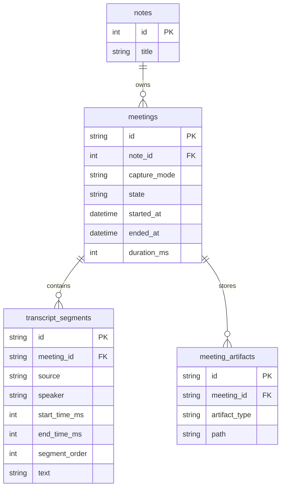
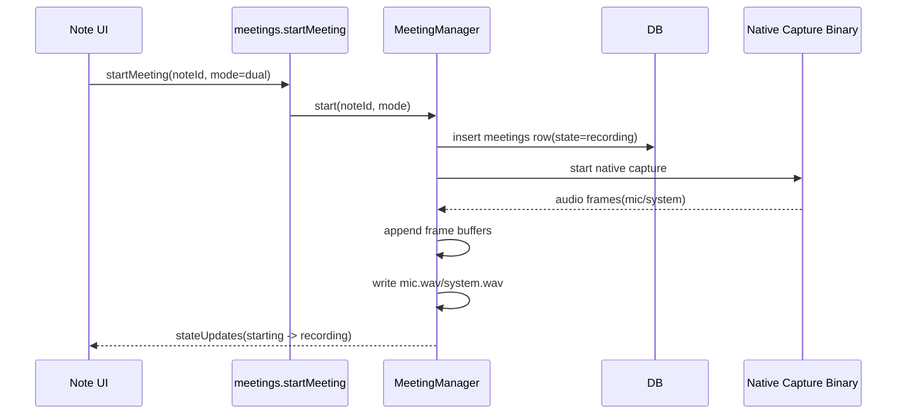
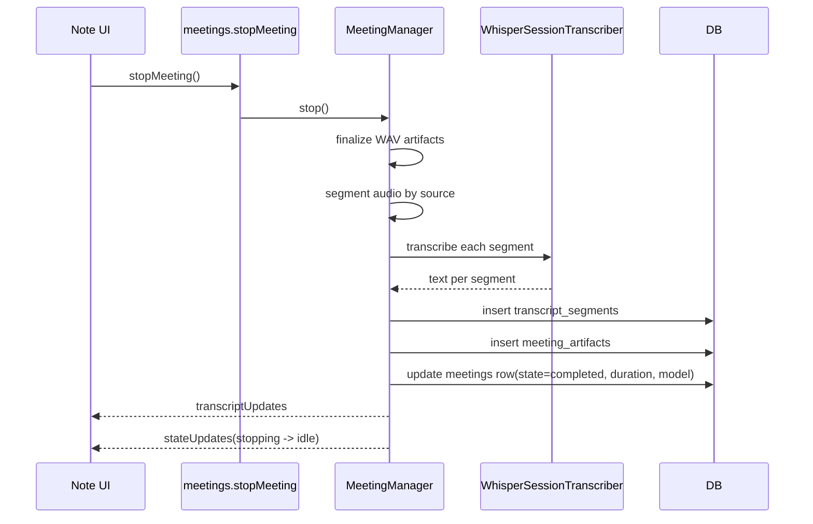
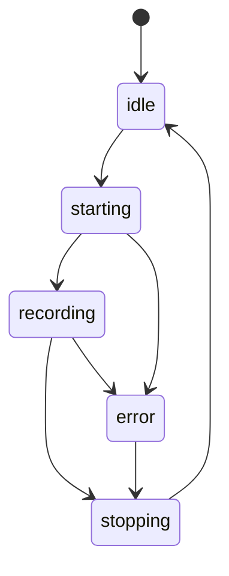

# Note-Scoped Meeting Transcription

## Purpose

This document describes the current Prismical meeting transcription architecture after moving from a session-scoped transcript UI to a note-scoped transcript model.

The core product rule is simple:

- A note owns the transcript experience.
- Each recording click creates a new recording session for that note.
- The transcript panel shows the aggregate transcript across all completed sessions for the note.

This keeps the UX continuous while preserving session boundaries for storage, artifacts, retries, and debugging.

## Scope

Included:

- Native audio capture for `mic`, `system`, or `dual`
- Local Whisper-based transcription
- Raw WAV retention per session
- Note-scoped transcript aggregation

Not included:

- AI note generation
- Speaker diarization beyond `you` vs `them`
- Word-level storage
- Live streaming token-by-token transcription

## Design Constraints

We should stay as close to Amical's successful patterns as possible so maintenance stays cheap.

That means Prismical should continue to prefer:

- A manager-owned lifecycle in main process
- A thin tRPC router over that manager
- Renderer code that mostly subscribes and renders
- Reuse of existing local transcription pieces such as the Whisper wrapper and `StreamingWavWriter`
- Append-only persistence for raw artifacts and transcript rows

We intentionally do **not** introduce a large new domain framework for meetings.

## Alignment With Amical

These choices are deliberate:

| Concern                 | Amical pattern                            | Prismical choice                                         |
| ----------------------- | ----------------------------------------- | -------------------------------------------------------- |
| Lifecycle owner         | Main-process manager (`RecordingManager`) | Main-process manager (`MeetingManager`)                  |
| Transport to renderer   | tRPC mutations + subscriptions            | tRPC mutations + subscriptions                           |
| Raw audio persistence   | `StreamingWavWriter`                      | `StreamingWavWriter`                                     |
| Speech transcription    | local Whisper wrapper/provider chain      | local Whisper session transcriber over the same wrapper  |
| Renderer responsibility | thin UI over subscriptions                | thin UI over subscriptions                               |
| Persistence style       | append data, derive views on read         | append sessions/segments, derive note transcript on read |

Where Prismical differs:

- Prismical is note-first, not dictation-first.
- Prismical needs two sources: `mic` and `system`.
- Prismical stores multiple recording sessions against the same note.

## Domain Model

The product concept is:

- `Note`
- many `RecordingSession`
- many `TranscriptSegment`
- many `SessionArtifact`

In the current implementation, the session table is still named `meetings`. That is acceptable for now because it minimizes churn while the feature is settling. Conceptually, each `meetings` row is a note-linked recording session.

## Table Model

### `notes`

The canonical parent entity for transcript UX.

Important rule:

- We do not store a denormalized transcript blob on the note.

### `meetings`

Represents one recording session attached to a note.

Important columns:

- `id`
- `note_id`
- `started_at`
- `ended_at`
- `duration_ms`
- `capture_mode`
- `state`
- `transcription_model`
- `metadata`

Important rule:

- Every mic click creates a new row in `meetings`.

### `transcript_segments`

Represents final transcript output for one session.

Important columns:

- `id`
- `meeting_id`
- `source`
- `speaker`
- `text`
- `start_time_ms`
- `end_time_ms`
- `segment_order`
- `is_final`

Important rules:

- Stored timestamps are session-relative.
- `segment_order` is the canonical in-session ordering.
- We do not persist note-relative timestamps.

### `meeting_artifacts`

Represents persisted raw session artifacts.

Important columns:

- `id`
- `meeting_id`
- `artifact_type`
- `path`
- `size_bytes`

Important rule:

- For now we retain raw WAVs by default.

## Relationship Diagram



## Why We Keep Session-Based Storage

Even though the UI is note-scoped, storage should remain session-scoped.

Reasons:

- Each recording start/stop is a real capture boundary.
- Raw audio files naturally belong to one session.
- Retranscription and debugging naturally operate on one session.
- Failed sessions should not corrupt prior note transcript data.
- This is closer to Amical's recording-session mental model.

If we flattened everything into one giant note transcript table, we would make deletion, replay, retry, and artifact management harder with little product gain.

## Read Model

The transcript shown in the note is a derived read model.

Algorithm:

1. Load completed sessions for the note ordered by `started_at`.
2. Load all transcript segments for those sessions ordered by `segment_order`.
3. Maintain a running duration offset across prior sessions.
4. Project each session-relative segment into a note-relative display timestamp.

This gives the user a continuous transcript while keeping storage honest.

## Transcript Time Semantics

Displayed transcript time is:

- note-relative active recording time

Displayed transcript time is **not**:

- wall-clock time
- session-relative time
- time since the first session started in real life including idle gaps

Example:

- Session 1 duration: `08:00`
- Session 2 starts two hours later
- First displayed segment in session 2 appears around `08:00`, not `02:08:00`

This is the least confusing UX and avoids counting idle gaps between recordings.

## Flow: Start Recording



## Flow: Stop And Finalize



## Flow: Note Transcript Read Path

```mermaid
flowchart TD
    A[Open note] --> B[Load note]
    B --> C[Query getNoteTranscript(noteId)]
    C --> D[Fetch completed sessions for note]
    D --> E[Fetch transcript_segments for those sessions]
    E --> F[Apply cumulative duration offsets]
    F --> G[Render merged note transcript]
```

## Runtime State Model



## UI Rules

- The note page is the owner of transcript presentation.
- Starting recording opens the transcription panel for the current note.
- Stopping recording does not replace the note transcript with one session; it refreshes the note aggregate.
- Re-recording into the same note extends the visible transcript because a new session is added under the same note.

## Ordering Rules

Ordering must be deterministic.

Session order:

- `meetings.started_at ASC`

Segment order inside a session:

- `transcript_segments.segment_order ASC`
- then `start_time_ms ASC`
- then `created_at ASC`

These extra tiebreaks are cheap and keep exports stable.

## Failure Rules

- If native capture fails before completion, the session row is marked `failed`.
- Previously completed sessions for the note remain untouched.
- Transcript aggregation only uses completed sessions.
- Raw artifacts can still exist for failed sessions if useful for debugging.

## Current File Map

Main runtime:

- `apps/desktop/src/main/managers/meeting-manager.ts`
- `apps/desktop/src/main/meetings/native-audio-capture-client.ts`
- `apps/desktop/src/main/meetings/whisper-session-transcriber.ts`
- `apps/desktop/src/main/meetings/energy-segmenter.ts`

Persistence:

- `apps/desktop/src/db/schema.ts`
- `apps/desktop/src/db/meetings.ts`
- `apps/desktop/src/db/migrations/0005_wide_colossus.sql`

tRPC surface:

- `apps/desktop/src/trpc/routers/meetings.ts`

Renderer:

- `apps/desktop/src/renderer/main/pages/notes/components/note-wrapper.tsx`
- `apps/desktop/src/renderer/main/pages/notes/components/note.tsx`
- `apps/desktop/src/renderer/main/pages/notes/components/note-assets-panel.tsx`
- `apps/desktop/src/renderer/main/pages/notes/components/note-recording-dock.tsx`

## YAGNI Decisions

We are intentionally not adding:

- a separate `note_transcript` table
- word-level transcript storage
- diarization beyond `you` vs `them`
- live partial transcript persistence
- AI note generation in the same pipeline
- a second abstraction layer over manager/router/db helpers

These can be added later if product pressure justifies them.

## Rename Guidance

If we later want terminology to be stricter, the most likely rename is:

- table name `meetings` -> `recording_sessions`

That rename is not necessary right now.

The current implementation is acceptable because:

- the product concept is clear in this document
- the storage behavior is correct
- changing names too early would create churn without user value

## Summary

Prismical meeting transcription should remain:

- note-scoped in UX
- session-scoped in storage
- append-only in persistence
- manager-driven in main process
- thin in renderer
- close to Amical's successful architecture wherever the product requirements still match
