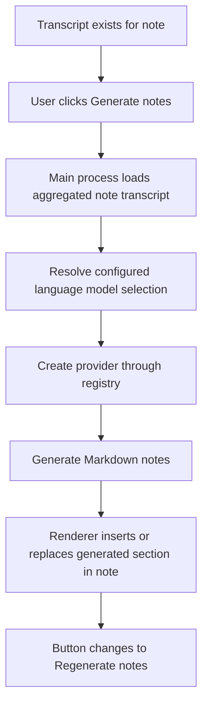
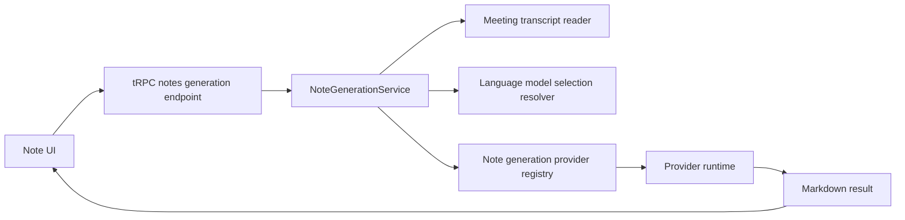
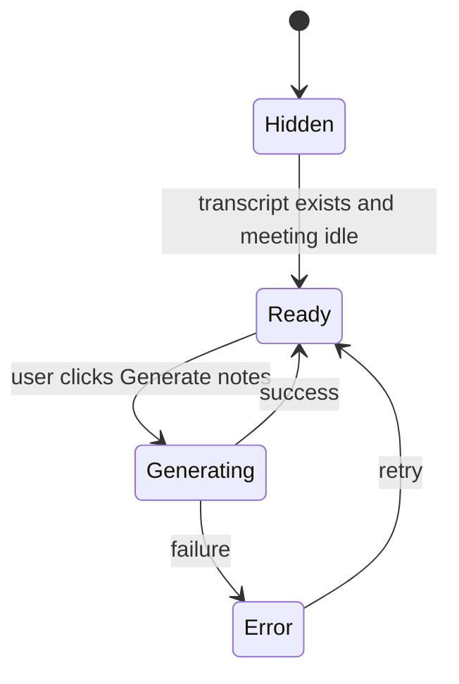

# v0.3 Generate Notes From Transcript

## Summary

After a note has transcript content, Prismical should show a manual `Generate notes` action.
Clicking it should run the currently configured language model against the note's aggregated meeting transcript and return clean Markdown meeting notes.

This is intentionally a note-generation feature, not a dictation-formatting feature.

The design should align with Amical where it matters:

- language-model selection should move to an Amical-style composite selection value
- provider creation should use a lightweight registry/factory
- the manager/service should not be hardcoded to one provider

The design should stay simpler than Amical where that complexity is not yet needed:

- manual generation only
- no background jobs
- no generation history table
- no model awareness of Lexical, Yjs, or editor internals

## Goals

- Show a `Generate notes` button once transcript content exists for a note.
- Use the configured language model to generate Markdown notes from the note transcript.
- Keep the LLM contract editor-agnostic: transcript in, Markdown out.
- Align provider/model selection structure with Amical's LLM-side approach.
- Keep transcript ownership with meetings/sessions and note content ownership with the note editor.

## Non-goals

- No automatic note generation after transcription completes.
- No streaming note generation.
- No attempt to merge AI output semantically with arbitrary existing note content.
- No generation history/versioning table in v0.3.
- No separate "note generation model" setting yet.
- No requirement that the LLM know anything about Yjs or Lexical JSON.

## User-facing behavior

### Button visibility

Show `Generate notes` when all of the following are true:

- the current note has at least one transcript segment
- the meeting runtime for this note is `idle`
- note generation is not currently running

If a generation already exists for the note, the label becomes `Regenerate notes`.

If no language model is configured, show the button disabled with guidance to configure an AI model.

### What transcript is used

Generation always uses the note-level aggregated transcript:

- all completed recording sessions linked to the note
- ordered by session start time
- then by transcript segment order/time within each session

This keeps the user mental model simple:

- transcript belongs to the note
- every generation run uses the note's current full transcript

### Manual flow



## Core product decisions

### 1. Use the default language model, not formatterConfig

v0.3 should use the configured default language model from AI model settings.

It should not reuse dictation `formatterConfig` as the source of truth.

Reason:

- note generation is a note feature, not a dictation formatting toggle
- `formatterConfig` currently contains dictation-specific behavior and the `prismical-cloud` pseudo-option
- using `defaultLanguageModel` is the cleanest first product model

### 2. LLM output is Markdown only

The generation provider contract should be:

- input: transcript text and prompt context
- output: Markdown string

The LLM should not know:

- Lexical editor state
- Yjs update storage
- note editor selection
- note persistence format

That translation belongs in Prismical's renderer/editor layer.

### 3. Transcript stays session-based in storage

This feature does not change the meeting/session model.

Source of truth remains:

- `meetings`
- `transcript_segments`
- `meeting_artifacts`

Note generation reads the aggregated transcript view of that data.

### 4. Keep insertion deterministic and app-owned

The model generates Markdown.
Prismical decides how that Markdown lands in the note.

v0.3 insertion policy:

- if the note has no previously generated section, insert one at the top of the note
- if the note already has a generated section, replace that generated section
- user-written content outside that generated section is preserved

To make this deterministic, the generated section should be wrapped in app-owned markers:

```md
<!-- prismical:generated-notes:start -->

## Meeting Notes

...

<!-- prismical:generated-notes:end -->
```

These markers are an app concern, not a model concern.

## Architecture

### High-level split



### Main-process ownership

Main process should own:

- transcript loading
- prompt construction
- model selection resolution
- provider creation
- provider execution
- generation metadata for telemetry/logging

Renderer should own:

- showing the button/loading/error state
- receiving generated Markdown
- replacing/inserting the generated section in the note editor
- letting Yjs persist the resulting editor state normally

### Service boundaries

#### `NoteGenerationService`

New main-process service responsible for:

- loading the aggregated note transcript
- resolving the selected language model
- creating the right provider through a registry
- invoking note generation
- returning Markdown + metadata

This service should not know about:

- meeting runtime capture state beyond transcript availability
- Lexical/Yjs document internals

#### `NoteGenerationProvider`

Provider contract should stay simple and editor-agnostic.

Suggested shape:

```ts
interface NoteGenerationProvider {
  readonly name: string;
  generateMarkdown(input: {
    transcript: string;
    noteTitle?: string;
    eventTitle?: string;
  }): Promise<{
    markdown: string;
    usage?: {
      inputTokens?: number;
      outputTokens?: number;
    };
  }>;
}
```

This is intentionally separate from `FormattingProvider`.

Reason:

- formatting providers are specialized around cleanup/formatting semantics
- note generation is a higher-level content synthesis task
- both may share lower-level provider creation later, but they are not the same application contract

## Amical alignment

### What to copy

Prismical should copy the LLM-side structural ideas from Amical:

- provider type constants
- system provider instance IDs
- composite model selection values
- model-selection parsing and resolution helpers
- lightweight provider registry/factory

Files in Amical that represent the target shape:

- `apps/desktop/src/constants/provider-types.ts`
- `apps/desktop/src/utils/model-selection.ts`
- `apps/desktop/src/pipeline/providers/formatting/remote-formatting-provider-registry.ts`

### What not to copy blindly

Do not copy Amical's dictation/transcription service shape for this.

This is closer to Amical's LLM formatting model selection path than its speech-transcription path.

## Model selection design

### Problem with Prismical today

Prismical currently stores `defaultLanguageModel` as a raw model ID.

That is too weak once there are multiple providers or multiple provider instances:

- model IDs can overlap
- removing one provider becomes ambiguous
- future custom/OpenAI-compatible style providers will need stronger identity

### Proposed selection value

Move language model selection to a composite value:

```text
providerInstanceId::language::modelId
```

Examples:

```text
system-openrouter::language::openai/gpt-4.1-mini
system-ollama::language::llama3.2
```

### Backward compatibility

Like Amical, resolution should support legacy raw IDs during migration:

- if a stored value is already composite, use it
- if a stored value is a raw model ID, resolve it against current models
- if it matches exactly one model, convert it to composite form
- if it matches zero or multiple models, treat it as invalid

This keeps existing Prismical users from losing their language model selection.

## Provider registry design

### v0.3 initial provider set

Support the providers Prismical already has today:

- OpenRouter
- Ollama

The structure should make adding more providers straightforward later.

### Registry pattern

Use a lightweight registry like Amical's formatting registry:

```ts
type NoteGenerationProviderType = "openrouter" | "ollama";

createNoteGenerationProvider(
  settingsService,
  providerType,
  modelId,
): Promise<NoteGenerationProvider | null>
```

The registry should read provider configuration from settings:

- OpenRouter API key
- Ollama base URL

If configuration is missing, it returns `null` and generation fails with a user-facing configuration error.

## Prompt and input format

### Input transcript format

Note generation should receive a flattened transcript string.

Recommended format:

```text
[00:00] Them: Thanks everyone for joining.
[00:07] You: We should lock the launch plan today.
[00:15] Them: Risks are performance and docs.
```

This gives the model:

- speaker separation
- temporal order
- enough structure for action-item extraction

### Prompt style

Use the existing Prismical notes style as the baseline:

- clean Markdown
- concise
- structured
- headings and bullets only when they help
- action items called out explicitly

The current `prismical-notes` formatter prompt rules are a good starting point, but note generation should have its own prompt entrypoint because it is synthesizing notes from transcript, not merely polishing raw dictation.

### Output constraints

Return Markdown only.

No XML wrapper should be required for note generation.

The provider/service may normalize output by trimming surrounding whitespace, but should not otherwise rewrite the model output.

## UI behavior

### Button state machine



### Placement

Place the action in the notes experience where transcript context is already visible.

Recommended first placement:

- in the transcription panel header, near the close button

Reason:

- generation is semantically tied to transcript completion
- this avoids scattering meeting actions across multiple surfaces

### Labeling

- first run: `Generate notes`
- subsequent runs: `Regenerate notes`
- while busy: `Generating...`

## Insertion policy

### Ownership boundary

Main process returns Markdown.
Renderer owns note mutation.

### v0.3 insertion rules

1. Convert Markdown into editor content using renderer/editor utilities.
2. Replace the existing generated section if marker comments are present.
3. Otherwise insert the generated section at the top of the note.
4. Preserve user-authored content outside the generated section.

This keeps the first version safe:

- the user does not lose manual edits
- regenerate does not endlessly duplicate content

## API surface

### tRPC

Add a new notes-oriented endpoint, not a meetings endpoint.

Suggested shape:

```ts
notes.generateNotesFromTranscript({
  noteId: number;
}): Promise<{
  markdown: string;
  modelSelection: string;
  providerType: string;
  generatedAt: string;
}>
```

Reason:

- the action belongs to the note
- transcript is an input, not the product surface

### Telemetry/logging

Track:

- note ID
- transcript length
- selected model selection value
- provider type
- generation duration
- success/failure

Do not store generation history in the database yet.

## Error handling

User-facing failures should be explicit:

- no transcript available
- no language model configured
- provider credentials/config missing
- provider call failed
- empty model response

Errors should not mutate the note.

## Data model impact

### v0.3 database changes

Keep database impact minimal.

Required:

- none for generation history itself

Recommended:

- migrate `defaultLanguageModel` storage to composite selection values in app settings

Not needed in v0.3:

- no `note_generations` table
- no `generated_markdown` cache table
- no `llm_jobs` table

## Implementation order

1. Add Amical-style provider type constants and model-selection helpers to Prismical.
2. Migrate `defaultLanguageModel` to composite selection values with legacy raw-ID resolution.
3. Add a note-generation provider registry for OpenRouter and Ollama.
4. Add `NoteGenerationService` in the main process.
5. Add `notes.generateNotesFromTranscript(noteId)` tRPC mutation.
6. Add the `Generate notes` / `Regenerate notes` button in the transcript panel.
7. Insert returned Markdown into the note editor using app-owned generated-section markers.

## Explicit choices

- Manual button only, not auto-run
- Use note transcript aggregate, not one session only
- Use `defaultLanguageModel`, not dictation `formatterConfig`
- LLM returns Markdown only
- Renderer owns editor insertion
- Replace one generated section on regenerate instead of duplicating
- Copy Amical's LLM model-selection structure, not its speech-transcription wiring
